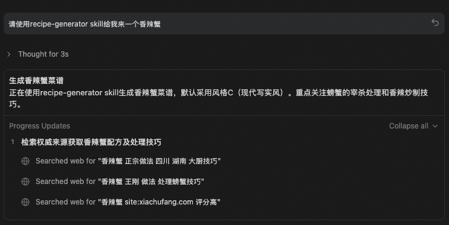
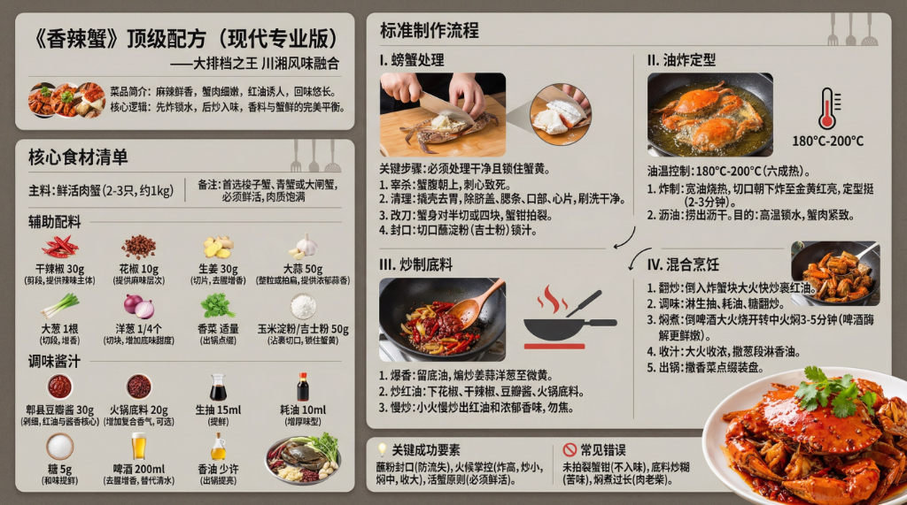

# Recipe Generator Skill

自动生成米其林级详细菜谱 + 高质量生图提示词。

## ✨ 功能特性

- **权威检索**：自动整合米其林、大厨、高分菜谱的专业技巧。
- **详实配方**：包含精确用量、核心原理、关键KPI和避坑指南。
- **生图提示词**：自动生成配套的nano banana pro提示词，支持多种风格。

## 📚 权威来源

优先检索以下经验证的专业信源，确保配方真实可靠：

- **顶级权威**：米其林指南、舌尖上的中国、中国烹饪协会、国宴配方
- **专业大厨**：王刚美食作家、美食台、日食记
- **高分验证**：下厨房（仅收录评分9.0+且1000+做过的高分菜谱）

## 📥 安装指南

### 方式一：Openskills CLI 
适用于开发环境，自动处理路径依赖。

```bash
# 1. 确保在包含 skill 的目录下
cd /path/to/parent-folder

# 2. 安装 skill
openskills install ./recipe-generator

# 3. 同步到 Agent 配置 (根据提示操作)
openskills sync
```

### 方式二：Claude 标准安装
手动将 Skill 集成到 Claude 项目的标准方式。

1. **定位技能目录**：在您的项目根目录下找到 `.claude/skills/` 文件夹（如不存在请手动创建）。
2. **复制文件**：将整个 `recipe-generator` 文件夹复制到该目录下。
   - 最终路径应为：`YourProject/.claude/skills/recipe-generator/`
3. **验证**：确保 `SKILL.md` 文件位于正确位置。

## 🚀 如何使用

1. **自然语言触发**
   - "请使用recipe-generator skill给我来一个清蒸鱼，plan B风格"
   - "给我一个红烧肉的菜谱"
   - "宫保鸡丁怎么做？"



2. **指定生图风格**
   - **默认 (风格C)**：`"红烧肉配方"` -> 输出现代写实风提示词
   - **风格A**：`"红烧肉配方，plan A风格"` -> 输出传统海报提示词
   - **风格B**：`"红烧肉配方，plan B风格"` -> 输出文人卷轴提示词

## 🎨 风格说明

| 风格 | 关键词 | 说明 |
|------|--------|------|
| **C (默认)** | `Plan C` / `现代` | 现代写实，适合专业教程 |
| **A** | `Plan A` / `海报` | 传统海报，视觉冲击强 |
| **B** | `Plan B` / `卷轴` | 横版文人卷轴，素雅内敛 |

## 🖼️ 效果展示

**风格C（默认）生成效果：**


